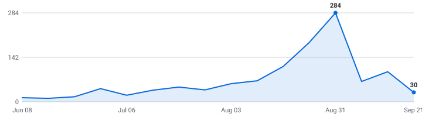

# 🍁 Canada & Japan Tech Internships

**A self-updating engine that tracks tech internships so you don't have to.**

&nbsp;&nbsp;&nbsp;

### 33 open roles (24 listed below) · 33 new this week

4,414 employers tracked · data as of Sep 03, 2026 at 21:02 UTC

_13 have a cycle the employer stated · 20 are recent postings whose cycle isn't stated (listed separately, never mixed in)._

**[🖥️ Live dashboard](https://parkerhayashi.github.io/Automated-List-Of-Summer-2027-and-Fall-2026-Tech-Internships/)** · **[📡 RSS](https://parkerhayashi.github.io/Automated-List-Of-Summer-2027-and-Fall-2026-Tech-Internships/feed.xml)** · **[⚙️ JSON API](https://parkerhayashi.github.io/Automated-List-Of-Summer-2027-and-Fall-2026-Tech-Internships/api/jobs.json)**

> [!TIP]
> **⭐ Star this repo** to save it and get updates when new roles are added.

Instead of refreshing a dozen career pages by hand, it reads company hiring feeds directly and keeps one live list — newest roles on top, refreshed automatically throughout the day.

**🔔 New roles in your inbox:** [RSS](https://parkerhayashi.github.io/Automated-List-Of-Summer-2027-and-Fall-2026-Tech-Internships/feed.xml) or [Feedrabbit](https://feedrabbit.com/subscriptions/new?url=https%3A%2F%2Fraw.githubusercontent.com%2Fparkerhayashi%2FAutomated-List-Of-Summer-2027-and-Fall-2026-Tech-Internships%2Fmain%2Fdocs%2Ffeed.xml).

---

## What this is

This is an engine, not a hand-kept list. It polls company career feeds every 30 minutes, finds the internships, removes duplicates, and rebuilds this page on its own.

Every link comes straight from the source — so it's real and current, not a stale list someone forgot to update. Speed matters.

## What makes this different

| | |
|---|---|
| 📅 **[Drop Radar](#drop-radar)** | A forecast of **what's coming**. Each marquee company's typical opening window, replaced by the real drop date the moment the engine catches it live. Windows are estimates and labelled as such; only dates the engine saw itself are marked verified. |
| 🛂 **Work authorization, from the posting** | 🇨🇦 / 🇯🇵 / 🛂 flags detected automatically from every job description — citizenship required, or the employer says it won't sponsor a work permit. Most postings say nothing either way, and those show as unknown rather than guessed. |
| 📆 **A real date on nearly every role** | Taken from the job portal itself wherever the portal states one, so newest-first actually means newest. The exact coverage figure is printed at the bottom of this page every run. |
| 🧰 **Skill tags + pay, extracted** | Every posting's text is scanned for the stack it wants (Python, C++, PyTorch, …) and the pay it states — searchable on the [dashboard](https://parkerhayashi.github.io/Automated-List-Of-Summer-2027-and-Fall-2026-Tech-Internships/), and included in the CSV and API. |
| 🔔 **Alerts your way** | [RSS](https://parkerhayashi.github.io/Automated-List-Of-Summer-2027-and-Fall-2026-Tech-Internships/feed.xml) — point any reader, or a Slack/Discord RSS integration, at it. Plus a [live dashboard](https://parkerhayashi.github.io/Automated-List-Of-Summer-2027-and-Fall-2026-Tech-Internships/) with search, filters, and a saved-roles list that never leaves your browser. |
| ⚙️ **An engine, not a spreadsheet** | 4,661 job-board endpoints (4,414 distinct employers; some run more than one board) polled every 30 minutes across 12 ATS platforms. Full source and tests in this repo. |

## Scope

| | |
|---|---|
| **Roles** | Software Engineering, Data Science & Machine Learning (and closely related technical internships) |
| **Region** | Canada & Japan |
| **Cycles** | Summer 2027 |

## About

This fork of the internship engine tracks software, data, and ML internships and co-ops located in Canada and Japan for Summer 2027, plus recent postings that don't name a cycle.

Use it to spot roles early and apply before they fill up. Being first genuinely helps.

## Where this is going

I'm building this in the open and adding to it as it grows.

**Recently shipped:** the Drop Radar · auto-detected sponsorship flags · the live dashboard

**Next up:** personalized alerts (pick your categories) · per-company hiring pages · a ghost-posting detector

If it helps you, a star means a lot and tells me to keep going.

## How to use

<b>Reading the table — flags, dates, and the cycle split</b> (click to expand)

- Roles are grouped by cycle below - **newest posting on top, oldest at the bottom.**
- A cycle section holds only roles whose **employer stated that cycle** - in the title, or in the posting's own text. Postings that name no cycle anywhere are in *Recently posted — cycle not stated* further down, with **no cycle guessed for them**. Same quality bar, different amount of evidence.
- The **Posted** column is the date the company published the role.
- **_(3 openings)_ after a role title** = the employer has that many separate live requisitions for the same job, in the same place, for the same cycle. They're all real and each takes its own application, so they're linked individually (**Apply**, then **#2**, **#3**) instead of repeating the row. Counts still count requisitions, and the CSV export is never grouped.
- **🆁 after a company name** = **this role is remote** — the posting's own location or title says so. It marks the role on that row, not the whole company.
- **Flags after a role title:** 🇨🇦 = requires Canadian citizenship, permanent residency, or a security clearance · 🇯🇵 = requires Japanese citizenship or nationality · 🛂 = the posting says it won't sponsor a work permit · 🆕 = spotted in the last 48 hours. Sponsorship flags are detected automatically from each job description - treat them as a strong hint and confirm on the posting.

- Track your applications with [`data/internships.csv`](data/internships.csv) (opens in Excel / Google Sheets).
- Missing a company? Adding one takes a single line, see [CONTRIBUTING.md](CONTRIBUTING.md).

---

## Summer 2027  (10 employer-stated)

| Company | Role | Category | Location | Skills | Posted | Apply |
|---|---|---|---|---|---|---|
| Geotab | Hardware Developer Intern (Summer/May 2027, 12 Months) 🆕 | Hardware | Oakville, Ontario - Canada | No skills listed | Sep 02, 2026 | [Apply](https://job-boards.greenhouse.io/internshiplist2000/jobs/5380567008) |
| TC Energy | Student Intern, Computer Science 🆕 | Software | Calgary, Alberta | No skills listed | Sep 01, 2026 | [Apply](https://tcenergy.wd3.myworkdayjobs.com/CAREER_SITE_TC/job/Calgary-Alberta/Student-Intern--Computer-Science_JR-10733) |
| Manulife Financial | Summer Intern 2027 - AI 🆕 | Data & ML/AI | Toronto, Ontario | Python, Java, SQL, PyTorch | Aug 31, 2026 | [Apply](https://manulife.wd3.myworkdayjobs.com/MFCJH_Jobs/job/Toronto-Ontario/Summer-Intern-2027---AI_JR26081688) |
| Manulife Financial | Summer Intern 2027 - Software Engineering (8 Months) 🆕 | Software | Toronto, Ontario | Python, Java, JavaScript, HTML/CSS | Aug 31, 2026 | [Apply](https://manulife.wd3.myworkdayjobs.com/MFCJH_Jobs/job/Toronto-Ontario/Summer-Intern-2027---Software-Engineering--8-Months-_JR26081685) |
| Manulife Financial | Summer Intern 2027 - Software Engineering 🆕 | Software | Toronto, Ontario | Python, Java, JavaScript, HTML/CSS | Aug 31, 2026 | [Apply](https://manulife.wd3.myworkdayjobs.com/MFCJH_Jobs/job/Toronto-Ontario/Summer-Intern-2027---Software-Engineering_JR26081684) |
| Royal Bank of Canada | 2027 Summer - GRM, AI Innovation - Business Analyst Intern (4 Months) 🆕 | Data & ML/AI | TORONTO, Ontario, Canada | Python, PyTorch, TensorFlow, scikit-learn | Aug 31, 2026 | [Apply](https://rbc.wd3.myworkdayjobs.com/ExternalPrivatePostingStudents/job/TORONTO-Ontario-Canada/XMLNAME-2027-Summer---GRM--AI-Innovation---Business-Analyst-Intern--4-Months-_R-0000182977) |
| Lumentum | Software Verification Engineer (Co-op/Intern) 🆕 _(2 openings)_ | Software | Canada - Ottawa (Bill Leathem) | Python, C#, Bash, Linux | Aug 28, 2026 | [Apply](https://lumentum.wd5.myworkdayjobs.com/LITE/job/Canada---Ottawa-Bill-Leathem/Software-Verification-Engineer--Co-op-Intern-_20261135) [#2](https://lumentum.wd5.myworkdayjobs.com/LITE/job/Canada---Ottawa-Bill-Leathem/Software-Verification-Engineer--Co-op-Intern-_20261136) |
| Ontario Teachers' Pension Plan | Intern- Investments, Infrastructure & Natural Resources (May 2027- 4 Month Contract) 🆕 | Software | Toronto, Canada | No skills listed | Aug 21, 2026 | [Apply](https://otppb.wd3.myworkdayjobs.com/OntarioTeachers_Careers/job/Toronto-Canada/Intern--Investments--Infrastructure---Natural-Resources--May-2027--4-Month-Contract-_7163) |
| Georgian Partners Growth | AI/ML Engineer Intern (2027) 🆕 | Data & ML/AI | Toronto Headquarters | Python, PyTorch, TensorFlow, scikit-learn | Jul 14, 2026 | [Apply](https://jobs.ashbyhq.com/georgian/2ae71a4b-dd9d-4068-8ef2-81351ee74cab) |
| Squarepoint Capital | Intern Software Developer - Montreal - 2027 🆕 | Software | Montreal | Python, Java, C++, Rust | May 07, 2026 | [Apply](https://www.squarepoint-capital.com/open-opportunities?id=7905463&gh_jid=7905463) |

## Recently posted — cycle not stated  (13 roles)

These postings never name a cycle — not in the title, not in the posting text — so neither do we. They're recent tech internships (posted within the last few weeks), often exactly the early drops worth applying to first; we just can't tell you which cycle they're for, and we'd rather say so than guess. The moment a posting's own text states a cycle, the role moves up into that section automatically.

| Company | Role | Category | Location | Skills | Posted | Apply |
|---|---|---|---|---|---|---|
| PlayStation | Software Developer Co-op - Build & Tools 🆕 | Software | Canada, Waterloo, ON | Vue | Sep 03, 2026 | [Apply](https://job-boards.greenhouse.io/waterloocoop/jobs/6180264004) |
| Teledyne | LiDAR Data Analyst (Co-op) 🆕 | Data & ML/AI | Canada - Concord, ON (TDY) | Python, C++, MATLAB | Sep 03, 2026 | [Apply](https://flir.wd1.myworkdayjobs.com/flircareers/job/Canada---Concord-ON-TDY/LiDAR-Data-Analyst--Co-op-_REQ36378) |
| Intelcom / Dragonfly | Front-End Developer Intern - Power Platform Integration 🆕 | Software | Canada, Quebec, Montreal | TypeScript, JavaScript, React, Azure | Sep 01, 2026 | [Apply](https://intelcomgroup.wd3.myworkdayjobs.com/Intelcom/job/Canada-Quebec-Montreal/Front-End-Developer-Intern---Power-Platform-Integration_JR111615-1) |
| Intelcom / Dragonfly | Software Development Intern - Address Intelligence Platform 🆕 | Software | Canada, Quebec, Montreal | Python, Java, C#, TypeScript | Sep 01, 2026 | [Apply](https://intelcomgroup.wd3.myworkdayjobs.com/Intelcom/job/Canada-Quebec-Montreal/Software-Development-Intern---Address-Intelligence-Platform_JR111611) |
| Intelcom / Dragonfly | Software Development Intern - Warehouse Productivity 🆕 | Software | Canada, Quebec, Montreal | C#, Azure | Sep 01, 2026 | [Apply](https://intelcomgroup.wd3.myworkdayjobs.com/Intelcom/job/Canada-Quebec-Montreal/Software-Development-Intern---Warehouse-Productivity_JR111578-1) |
| Stripe | Software Engineer, Intern (Summer or Winter) 🆕 | Software | Toronto | Java, JavaScript, Scala, Ruby | Aug 31, 2026 | [Apply](https://stripe.com/jobs/search?gh_jid=8130805) |
| Ciena | AI & Automation Intern - GCN Services Business Operations 🆕 | Data & ML/AI | Ottawa | No skills listed | Aug 31, 2026 | [Apply](https://ciena.wd5.myworkdayjobs.com/careers/job/Ottawa/Resourcing-and-Enablement-Intern_R030908) |
| Autodesk | Intern, AI Developer/ Stagiaire en développement IA 🆕 | Data & ML/AI | Montreal, QC, CAN | Python, C++, PyTorch, TensorFlow | Aug 30, 2026 | [Apply](https://autodesk.wd1.myworkdayjobs.com/Ext/job/Montreal-QC-CAN/Intern--AI-Developer--Stagiaire-en-dveloppement-IA_26WD100523-2) |
| Epic Games | Machine Learning Intern 🆕 | Data & ML/AI | Montreal,Quebec,Canada | Python, C++, C#, PyTorch | Aug 07, 2026 | [Apply](https://epicgames.com/careers/jobs/6138140004?gh_jid=6138140004) |
| Kobo | Software Quality Assurance Co-op 🆕 | Software | Toronto, Canada | Java, C#, SQL, Kotlin | Aug 07, 2026 | [Apply](https://rakuten.wd1.myworkdayjobs.com/Kobo/job/Toronto-Canada/Software-Quality-Assurance-Co-op_1036325) |
| InstaLILY | Software Engineer I, Toronto Co-op 🆕 | Software | Toronto | Python, TypeScript, LLMs, AWS | Jul 31, 2026 | [Apply](https://job-boards.greenhouse.io/instalilyai/jobs/4342089009) |
| Later | Software Development Co-op (Later Influence) 🆕 | Software | Vancouver, British Columbia, Canada | Python, Java, C#, TypeScript | Jul 22, 2026 | [Apply](https://job-boards.greenhouse.io/later/jobs/8643138002) |
| ShyftLabs | AI Engineer Intern 🆕 | Data & ML/AI | Toronto, Ontario | Python, LLMs, AWS, Kubernetes | Jul 21, 2026 | [Apply](https://jobs.lever.co/shyftlabs/4f389ea7-9b98-4ed0-99c2-b25ea8cc2dcd) |

## 📅 Drop Radar — when companies usually post for Summer 2027

Stop refreshing career pages. 🎯 = the employer's **own posted date**, read from their careers API. (We may have discovered the role after it went live — the date is the employer's, not our discovery time.) The rest are typical opening **months**, hand-checked against each company's careers page and public recruiting guides. ✅ = already live in the list above.

> **Heads up:** companies trend *earlier* every cycle, and "~Aug" is a month, not a day. Treat "expected" as when to **start watching**, and "rolling" companies as worth checking year-round.

| Company | Typical opening | Expected this cycle | Status |
|---|---|---|---|
| Accenture | ~Aug | ~Aug · any day now | ⏳ waiting |
| AQR Capital Management | ~Aug | ~Aug · any day now | ⏳ waiting |
| Atlassian | ~Aug | ~Aug · any day now | ⏳ waiting |
| Bridgewater Associates | ~Aug | ~Aug · any day now | ⏳ waiting |
| Cisco | ~Aug | ~Aug · any day now | ⏳ waiting |
| Citadel | ~Aug | ~Aug · any day now | ⏳ waiting |
| Databricks | ~Aug | ~Aug · any day now | ⏳ waiting |
| DoorDash | ~Aug | ~Aug · any day now | ⏳ waiting |
| DRW | ~Aug | ~Aug · any day now | ⏳ waiting |
| Figma | ~Aug | ~Aug · any day now | ⏳ waiting |
| Google | ~Aug | ~Aug · any day now | ⏳ waiting |
| Intuit | ~Aug | ~Aug · any day now | ⏳ waiting |
| Jane Street | ~Aug | ~Aug · any day now | ⏳ waiting |
| John Deere | ~Aug | ~Aug · any day now | ⏳ waiting |
| Meta | ~Aug | ~Aug · any day now | ⏳ waiting |
| Optiver | ~Aug | ~Aug · any day now | ⏳ waiting |
| Pinterest | ~Aug | ~Aug · any day now | ⏳ waiting |
| Salesforce | ~Aug | ~Aug · any day now | ⏳ waiting |
| SIG | ~Aug | ~Aug · any day now | ⏳ waiting |
| Snowflake | ~Aug | ~Aug · any day now | ⏳ waiting |
| Target | ~Aug | ~Aug · any day now | ⏳ waiting |
| Tesla | ~Aug | ~Aug · any day now | ⏳ waiting |
| Uber | ~Aug | ~Aug · any day now | ⏳ waiting |
| Visa | ~Aug | ~Aug · any day now | ⏳ waiting |
| Walmart | ~Aug | ~Aug · any day now | ⏳ waiting |
| 3M | ~Sep | ~Sep · any day now | ⏳ waiting |
| Adobe | ~Sep | ~Sep · any day now | ⏳ waiting |
| Airbnb | ~Sep | ~Sep · any day now | ⏳ waiting |
| AMD | ~Sep | ~Sep · any day now | ⏳ waiting |
| Anduril Industries | ~Sep | ~Sep · any day now | ⏳ waiting |

_267 companies on the [full radar](https://parkerhayashi.github.io/Automated-List-Of-Summer-2027-and-Fall-2026-Tech-Internships/#radar). **138** dated from our own live observations 🎯 (this grows every cycle). "~Aug" = hand-verified typical month, not a promise of the day; "rolling" = posts year-round; "waiting" = not seen in our tracked feeds yet, not a guarantee it isn't out somewhere else._

<strong>Recently closed</strong> — 40 roles that left the list in the last 14 days

_Why each one left is in the last column, because the two reasons carry different evidence. **Gone from feed** = two consecutive complete reads of the employer's board no longer returned it (strong, but not the employer telling us directly). **Out of scope** = still posted, but it no longer passes our filters — our call, not theirs. **Not recorded** = closed before we started tracking the reason._

| Company | Role | Cycle | Closed | Why |
|---|---|---|---|---|
| Amazon | Software Development Engineer Intern, Annapurna Labs - 2027 | Summer 2027 | 2026-09-03 | out of scope |
| Ellipsis Labs | Software Engineer - 2027 Interns | Summer 2027 | 2026-09-03 | out of scope |
| Heliux | Software Engineer (Internship, Summer 2027) | Summer 2027 | 2026-09-03 | out of scope |
| Melius | Software Engineering Intern [Spring/Summer 2027] | Summer 2027 | 2026-09-03 | out of scope |
| Northwood Space | Software Engineering Intern (2027 Summer Internship) | Summer 2027 | 2026-09-03 | out of scope |
| Northwood Space | Embedded Software Engineering Intern (2027 Summer Internship) | Summer 2027 | 2026-09-03 | out of scope |
| Notion | Software Engineer Intern (Summer 2027) | Summer 2027 | 2026-09-03 | out of scope |
| Quadrillion | Software Engineering Intern (Summer 2027) | Summer 2027 | 2026-09-03 | out of scope |
| The Voleon Group | Software Engineer Intern - (Summer 2027) | Summer 2027 | 2026-09-03 | out of scope |
| Wavetronix | Computer Science Internship Summer 2027 | Summer 2027 | 2026-09-03 | out of scope |
| Advanced Space | 2027 Software Engineering Summer Internship | Summer 2027 | 2026-09-03 | out of scope |
| Advanced Space | 2027 Machine Learning Summer Internship | Summer 2027 | 2026-09-03 | out of scope |
| Advanced Space | 2027 DevOps Summer Internship | Summer 2027 | 2026-09-03 | out of scope |
| Akuna Capital | Software Engineer Intern - C++, Summer 2027 | Summer 2027 | 2026-09-03 | out of scope |
| Akuna Capital | Software Engineer Intern - Python, Summer 2027 | Summer 2027 | 2026-09-03 | out of scope |
| Akuna Capital | Platform Engineer Intern, Summer 2027 | Summer 2027 | 2026-09-03 | out of scope |
| Akuna Capital | Software Engineer Intern - C# .NET Desktop, Summer 2027 | Summer 2027 | 2026-09-03 | out of scope |
| Akuna Capital | Software Engineer Intern - Full Stack Web, Summer 2027 | Summer 2027 | 2026-09-03 | out of scope |
| Akuna Capital | Quantitative Research Intern, Summer 2027 | Summer 2027 | 2026-09-03 | out of scope |
| Anduril | 2027 Software Engineer Intern | Summer 2027 | 2026-09-03 | out of scope |
| Appian | Software Engineering Intern | Summer 2027 | 2026-09-03 | out of scope |
| Appian | Information Security Engineer Intern | Summer 2027 | 2026-09-03 | out of scope |
| Awetomaton | Platform Engineering Intern | Summer 2027 | 2026-09-03 | out of scope |
| Axon | 2027 US Firmware Engineering Internship | Summer 2027 | 2026-09-03 | out of scope |
| AXQ Capital | Quantitative Research Intern (Summer 2027) | Summer 2027 | 2026-09-03 | out of scope |
| BTI360 | Software Engineering Intern | Summer 2027 | 2026-09-03 | out of scope |
| Charles River Associates (CRA) | (2028 Bachelor's/Master's graduates) Cyber and Forensic Technology Consulting Analyst/Associate Intern (Summer 2027) | Summer 2027 | 2026-09-03 | out of scope |
| Chicago Trading Company | Quant Trading Internship - Summer 2027 | Summer 2027 | 2026-09-03 | out of scope |
| Chicago Trading Company | Software Engineering Internship - Summer 2027 | Summer 2027 | 2026-09-03 | out of scope |
| Dev Technology Group | AI/ML Intern (Summer 2027) | Summer 2027 | 2026-09-03 | out of scope |
| Dev Technology Group | React/Node Developer Intern (Summer 2027) | Summer 2027 | 2026-09-03 | out of scope |
| Dev Technology Group | Microsoft Power Platform & AI Intern (Summer 2027) | Summer 2027 | 2026-09-03 | out of scope |
| Dev Technology Group | AI/Agentic Solution Engineer Intern (Summer 2027) | Summer 2027 | 2026-09-03 | out of scope |
| DV Trading | Software Engineer Intern - Summer 2027 (DV Commodities) | Summer 2027 | 2026-09-03 | out of scope |
| Five Rings | Summer Intern 2027 - Quantitative Trader | Summer 2027 | 2026-09-03 | out of scope |
| Five Rings | Summer Intern 2027 - Software Developer | Summer 2027 | 2026-09-03 | out of scope |
| Flow Traders | Quantitative Trading Intern Summer 2027 | Summer 2027 | 2026-09-03 | out of scope |
| Freeform | Software Engineering Intern (Summer 2027) | Summer 2027 | 2026-09-03 | out of scope |
| General Matter | Summer 2027 Internship - Software Engineering | Summer 2027 | 2026-09-03 | out of scope |
| General Matter | Summer 2027 Internship - Embedded Software Engineering | Summer 2027 | 2026-09-03 | out of scope |

---

## Hiring timeline

Internships posted per week, from each role's real published date - redrawn automatically on every run. When this line takes off, recruiting season is open:

<picture>
  <source media="(prefers-color-scheme: dark)" srcset="docs/trends-dark.svg">
  
</picture>

## How it stays current

A small Python engine reads public company hiring feeds directly, keeps the roles that match the scope above, de-duplicates across sources, records each role's published date once (so it never shifts), and regenerates this page through GitHub Actions. It polls every company concurrently (async) with retry/backoff and per-host rate limits. The full source is in this repo.

_Engine (last run): 4,218 of 4,661 registered boards returned successfully across 12 ATS platforms (96% of boards attempted, 90% of the full registry) · completed in 823.1s · 583 board(s) returned a capped result set, so their roles were not eligible to be closed this run · employer or source-derived date on 100% of open roles._

## How this list is built

[METHODOLOGY.md](METHODOLOGY.md) documents exactly what every label claims — what separates a stated cycle from an inferred one, how sponsorship flags are detected, how a role gets closed, and which limitations are known. Anything on this page that doesn't match the code is a bug worth reporting.

## Contributing

Adding a company takes one line, see [CONTRIBUTING.md](CONTRIBUTING.md), or just [open a request](../../issues/new?template=add-company.yml) with the board URL. **Spotted something wrong?** [Report the exact field](../../issues/new?template=wrong-data.yml) — wrong country, wrong cycle, closed role, bad sponsorship flag. Those reports usually fix a rule, which fixes every other role too.

Also here: [PRIVACY.md](PRIVACY.md) (what the email list stores — an address and nothing else) · [SECURITY.md](SECURITY.md) · [ARCHITECTURE.md](ARCHITECTURE.md) · [MIT licensed](LICENSE).

Built by one student with AI assistance, in the open. The part that matters isn't who typed it — it's that the rules, the tests, and every run's output are all public and checkable.

## Note on dates

The **Posted** column shows when a role was published, with the newest at the top. I pull the posting date straight from each job portal, but a lot of them don't expose one publicly, so those rows show a dash (—) for now instead of a guessed date. The ones that do publish a date are dated. Know the real date for a dashed role? Open a PR and I'll merge it.

Roles can close at any time, so always confirm on the company's own site before applying.
